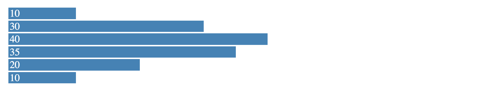

```{r setup, include=FALSE}
knitr::opts_chunk$set(fig.path = "tools/README/", dev = "png")
```


`R2D3` provides tools to render D3 scripts from R and integrates with `knitr`, `rmarkdown` and RStudio to provide native `d3` output chunks. Specifically, with `R2D3` you can:

- Render [D3](https://d3js.org/) scripts with ease in R as [htmlwidgets](https://www.htmlwidgets.org/).
- Use [Shiny](http://shiny.rstudio.com/) to create interactive D3 applications.

## Installation

Install this package by running:

```{r eval=FALSE}
devtools::install_github("rstudio/r2d3")
```

## Getting Started

For simple scripts we can rely on `r2d3` injecting javascript variables for the `root` html element, `data`, `width` and `height` as follows:

```{r echo=FALSE, comment=''}
cat(paste(readLines(system.file("samples/barchart.js", package = "r2d3")), collapse = "\n"))
```

Thenn, data can be rendered in D3 from R as follows, notice that we've changed the default element to `"div"` to create a `<div>` tag element instead of the default `<svg>` element:

```{r eval=FALSE}
r2d3::r2d3(
  c(10, 30, 40, 35, 20, 10),
  "inst/samples/barchart.js",
  tag = "div"
)
```


## Advanced Rendering

More advanced scripts can rely can make use of `r2d3.onRender()` which is similar to `d3.csv()`, `d3.json()`, and other D3 data loading libraries, to trigger specific code during render and use the rest of the code as initialization code, for instace:

```{r echo=FALSE, comment=''}
cat(paste(readLines(system.file("samples/bubbles.js", package = "r2d3")), collapse = "\n"))
```

```{r bubbles-chart}
flares <- read.csv(system.file("samples/flare.csv", package = "r2d3"))
r2d3::r2d3(
  flares[!is.na(flares$value), ],
  "inst/samples/bubbles.js",
  version = 4
)
```