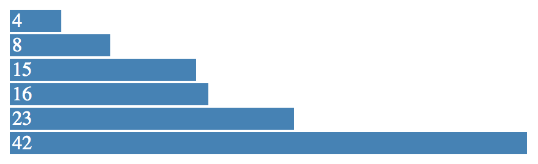
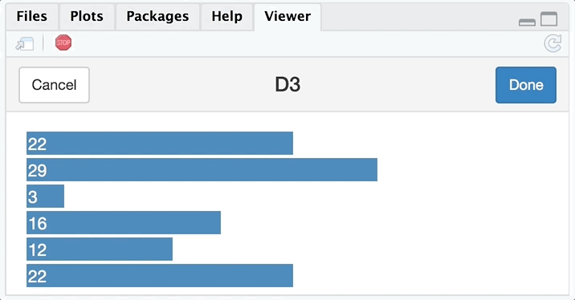

`R2D3` provides tools to render D3 scripts from R and integrates with `knitr`, `rmarkdown` and RStudio to provide native `d3` output chunks. Specifically, with `R2D3` you can:

- Render [D3](https://d3js.org/) scripts with ease in R as [htmlwidgets](https://www.htmlwidgets.org/).
- Send data from R to D3 with minimal changes to the D3 source.
- Animate R data with D3 scripts.

## Installation

Install this package by running:

```{r eval=FALSE}
devtools::install_github("rstudio/r2d3")
```

## Getting Started

### Static Data

Lets start with a static D3 script that renders a simple bar chart:

```{r echo=FALSE, comment=''}
cat(paste(readLines(system.file("samples/barchart-static.js", package = "r2d3")), collapse = "\n"))
```

This D3 script can be rendered R by running:

```{r eval=FALSE}
library(r2d3)
render(script = system.file("samples/barchart-static.js", package = "r2d3"))
```


Since we probably want to change the barchart data from R, we can copy this script as `barchart-variable.js` and remove the following line from the D3 script:

```{js}
var data = [4, 8, 15, 16, 23, 42];
```

then, from R we can pass this data as follows:

```{r eval=FALSE}
render(
  c(4, 8, 15, 16, 23, 42),
  system.file("samples/barchart-variable.js", package = "r2d3")
)
```

By default, data is injected to the D3 script as `data`; however, if the static data is contained in the D3 script with a different name, say as:

```{js}
var values = [4, 8, 15, 16, 23, 42];
```

we can then inject the data with that specific name as:

```{r eval=FALSE}
render(
  c(4, 8, 15, 16, 23, 42),
  script = system.file("samples/barchart-variable.js", package = "r2d3"),
  inject = "values"
)
```

### Dynamic Data

Data in D3 scripts is usually not static. Instead, D3 scripts make use of `d3.csv()`, `d3.json()` and similar functions to fetch data, this usually looks like the following D3 script:

```{r echo=FALSE, comment=''}
cat(paste(readLines(system.file("samples/barchart-json.js", package = "r2d3")), collapse = "\n"))
```

To make use of this script in R, we need to replace the data function (`d3.csv()`, `d3.tsv()`, `d3.json()`, `d3.xml()`, etc.) with `r2.d3()`. Also, you should replaced your root element selector, `d3.select("body")` in the example above, with the `r2.root` selector as follows:

```{r echo=FALSE, comment=''}
cat(paste(readLines(system.file("samples/barchart-dynamic.js", package = "r2d3")), collapse = "\n"))
```

With the modified script, data can be rendered in D3 as follows:

```{r eval=FALSE}
render(
  data = c(10, 30, 40, 35, 20, 10),
  system.file("samples/barchart-dynamic.js", package = "r2d3")
)
```


Finally, we can also animate data by proving a function and using `animate()`:

```{r eval=FALSE}
animate(
  function() floor(runif(6, 1, 40)),
  system.file("samples/barchart-dynamic.js", package = "r2d3")
)
```


