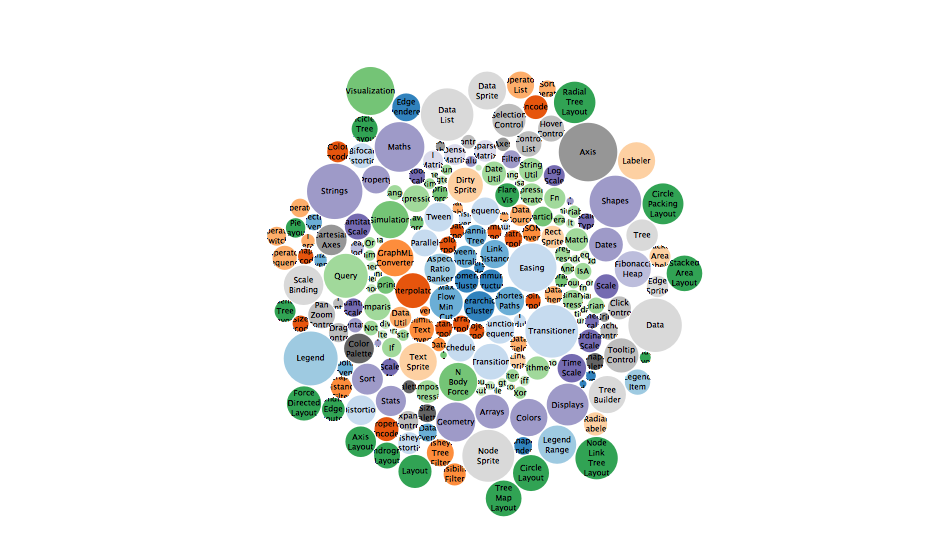

R to D3 rendering tools
================

# r2d3: R interface to D3 visualizations


The **r2d3** package provides a suite of tools for using [D3
visualizations](https://d3js.org/) with R, including:

  - Translating R data frames into D3 friendly data structures

  - Rendering D3 scripts within the RStudio Viewer and [R
    Notebooks](https://rmarkdown.rstudio.com/r_notebooks.html)

  - Incorporating D3 scripts into [R
    Markdown](https://rmarkdown.rstudio.com/) reports, presentations,
    and dashboards

  - Creating interacive D3 applcations with
    [Shiny](https://shiny.rstudio.com/)

  - Publishing D3 based [htmlwidgets](http://www.htmlwidgets.org) in R
    packages.

## Installation

Install this package by running:

``` r
devtools::install_github("rstudio/r2d3")
```

## Getting Started

To render D3 scripts, `r2d3` makes available the following variables:

  - **data**: The R data converted to JavaScript.
  - **svg**: The svg element with the right dimensions.
  - **width**: The width of the svg.
  - **height**: The height of the svg.
  - **options**: Additional options provided from R.

These variables can then be used in your D3 script as follows:

``` js
var barHeight = Math.floor(height / data.length);
svg.selectAll('rect')
    .data(data)
  .enter()
    .append('rect')
      .attr('width', function(d) { return d * width; })
      .attr('height', barHeight)
      .attr('y', function(d, i) { return i * barHeight; })
      .attr('fill', 'steelblue');
```

The above `barchart.js` script can be rendered from R by calling `r2d3`
as follows:

``` r
library(r2d3)
r2d3(
  c(0.3, 0.6, 0.8, 0.95, 0.40, 0.20),
  "barchart.js"
)
```


## Advanced Rendering

`r2d2` also makes available an `r2d3` object in JavaScript, this object
provides access to the `data`, `svg`, `width`, `height` and `options`
variables, but also provides access to additional functionality.

For instance, more advanced scripts can rely can make use of
`r2d3.onRender()` which is similar to `d3.csv()`, `d3.json()`, and other
D3 data loading libraries, to trigger specific code during render and
use the rest of the code as initialization code as follows:

``` js
// Initialization
svg.attr("font-family", "sans-serif")
  .attr("font-size", "8")
  .attr("text-anchor", "middle");
    
var pack = d3.pack()
  .size([width, height])
  .padding(1.5);
    
var format = d3.format(",d");
var color = d3.scaleOrdinal(d3.schemeCategory20c);

// Rendering
r2d3.onRender(function(data, svg, width, height, options) {
  var root = d3.hierarchy({children: data})
    .sum(function(d) { return d.value; })
    .each(function(d) {
      if (id = d.data.id) {
        var id, i = id.lastIndexOf(".");
        d.id = id;
        d.package = id.slice(0, i);
        d.class = id.slice(i + 1);
      }
    });

  var node = svg.selectAll(".node")
    .data(pack(root).leaves())
    .enter().append("g")
      .attr("class", "node")
      .attr("transform", function(d) { return "translate(" + d.x + "," + d.y + ")"; });

  node.append("circle")
      .attr("id", function(d) { return d.id; })
      .attr("r", function(d) { return d.r; })
      .style("fill", function(d) { return color(d.package); });

  node.append("clipPath")
      .attr("id", function(d) { return "clip-" + d.id; })
    .append("use")
      .attr("xlink:href", function(d) { return "#" + d.id; });

  node.append("text")
      .attr("clip-path", function(d) { return "url(#clip-" + d.id + ")"; })
    .selectAll("tspan")
    .data(function(d) { return d.class.split(/(?=[A-Z][^A-Z])/g); })
    .enter().append("tspan")
      .attr("x", 0)
      .attr("y", function(d, i, nodes) { return 13 + (i - nodes.length / 2 - 0.5) * 10; })
      .text(function(d) { return d; });

  node.append("title")
      .text(function(d) { return d.id + "\n" + format(d.value); });
});
```

Then, the above `bubbles.js` script can be rendered from R as follows.
Notice that this script requires D3 version 4 which can be specified
with the `version` parameter.

``` r
r2d3(
  read.csv("flare.csv"),
  "bubbles.js",
  version = 4
)
```

<!-- -->

You should also consider using `r2d3.onResize()` to provide a JavaScript
function with signature `function(width, height)` that performs the
actual resizing operation. Otherwise, by default, `r2d3` will rerun the
entire D3 script to resize the rendering.

## R Markdown

R Markdown can be used with `r2d3` to render a D3 script as an
htmlwidget as follows:

<pre><code>---
output: html_document
---

&#96``{r}
library(r2d3)

r2d3(
  c(10, 20, 30),
  "barchart.js"
)

&#96``</code></pre>

For `rmarkdown` documents and Notebooks, `r2d3` also adds support for
`d3` chunk that can be use to make the D3 code more readable:

<pre><code>&#96``{r setup}
library(r2d3)
bars <- c(10, 20, 30)
&#96``</code></pre>

<pre><code>&#96``{d3 data=bars, options='orange'}
svg.selectAll('rect')
    .data(data)
  .enter()
    .append('rect')
      .attr('width', function(d) { return d * 10; })
      .attr('height', '20px')
      .attr('y', function(d, i) { return i * 22; })
      .attr('fill', options);
&#96``</code></pre>


## Shiny

`r2d3` provides `renderD3()` and `d3Output()` to render under Shiny
apps:

``` r
library(shiny)
library(r2d3)

ui <- fluidPage(
  inputPanel(
    sliderInput("bar_max", label = "Max:",
      min = 10, max = 110, value = 10, step = 20)
  ),
  d3Output("d3")
)

server <- function(input, output) {
  output$d3 <- renderD3({
    r2d3(
      floor(runif(5, 5, input$bar_max)),
      system.file("baranims.js", package = "r2d3")
    )
  })
}

shinyApp(ui = ui, server = server)
```

We can also render D3 in a Shiny document as follows:

<pre><code>---
runtime: shiny
output: html_document
---

&#96``{r setup}
library(r2d3)
&#96``

&#96``{r echo=FALSE}
inputPanel(
  sliderInput("bar_max", label = "Max:",
    min = 10, max = 110, value = 10, step = 20)
)

bars &lt;- reactive({
   floor(runif(5, 5, input$bar_max))
})
&#96``

&#96``{d3 data=bars}
var bars = svg.selectAll('rect')
    .data(data);
    
bars.enter()
    .append('rect')
      .attr('width', function(d) { return d * 10; })
      .attr('height', '20px')
      .attr('y', function(d, i) { return i * 22; })
      .attr('fill', 'steelblue');

bars.exit().remove();

bars.transition()
  .duration(250)
  .attr("width", function(d) { return d * 10; });
&#96``</code></pre>


