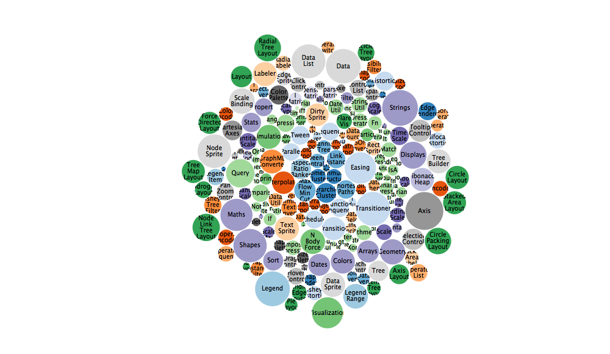

R to D3 rendering tools
================


`R2D3` provides tools to render D3 scripts from R and integrates with `knitr`, `rmarkdown` and RStudio to provide native `d3` output chunks. Specifically, with `R2D3` you can:

-   Render [D3](https://d3js.org/) scripts with ease in R as [htmlwidgets](https://www.htmlwidgets.org/).
-   Use [Shiny](http://shiny.rstudio.com/) with `R2D3` to create interactive D3 applications.

Installation
------------

Install this package by running:

``` r
devtools::install_github("rstudio/r2d3")
```

Getting Started
---------------

For simple scripts we can rely on `r2d3` injecting javascript variables for the `data`, tag which defaults to `svg` but can be changed, `width`, `height` and `options` as follows:

    // data, div, width, height and options are provided by r2d3

    var bars = root
      .selectAll("div")
        .data(data);
        
    bars.enter().append("div")
      .style("width", function(d) { return 4 + d * 10 + "px"; })
      .style("background-color", "steelblue")
      .style("border", "1px solid white")
      .style("color", "white")
      .style("padding-left", "2px")
      .text(function(d) { return d; });

    bars.exit().remove();

    bars.transition()
      .duration(250)
      .style("width", function(d) { return 4 + d * 10 + "px"; })
      .text(function(d) { return d; });

Data can be rendered in D3 from R as follows. Notice that, for this example, we've changed the default element to `"div"` to create a `<div>` tag element instead of the default `<svg>` element:

``` r
r2d3::r2d3(
  c(10, 30, 40, 35, 20, 10),
  "inst/samples/barchart.js",
  tag = "div"
)
```


Advanced Rendering
------------------

More advanced scripts can rely can make use of `r2d3.onRender()` which is similar to `d3.csv()`, `d3.json()`, and other D3 data loading libraries, to trigger specific code during render and use the rest of the code as initialization code, for instace:

    // Initialization
    svg.attr("font-family", "sans-serif")
      .attr("font-size", "10")
      .attr("text-anchor", "middle");
        
    var pack = d3.pack()
      .size([width, height])
      .padding(1.5);
        
    var format = d3.format(",d");
    var color = d3.scaleOrdinal(d3.schemeCategory20c);

    // Rendering
    r2d3.onRender(function(classes, svg, width, height, options) {
      var root = d3.hierarchy({children: classes})
        .sum(function(d) { return d.value; })
        .each(function(d) {
          if (id = d.data.id) {
            var id, i = id.lastIndexOf(".");
            d.id = id;
            d.package = id.slice(0, i);
            d.class = id.slice(i + 1);
          }
        });

      var node = svg.selectAll(".node")
        .data(pack(root).leaves())
        .enter().append("g")
          .attr("class", "node")
          .attr("transform", function(d) { return "translate(" + d.x + "," + d.y + ")"; });

      node.append("circle")
          .attr("id", function(d) { return d.id; })
          .attr("r", function(d) { return d.r; })
          .style("fill", function(d) { return color(d.package); });

      node.append("clipPath")
          .attr("id", function(d) { return "clip-" + d.id; })
        .append("use")
          .attr("xlink:href", function(d) { return "#" + d.id; });

      node.append("text")
          .attr("clip-path", function(d) { return "url(#clip-" + d.id + ")"; })
        .selectAll("tspan")
        .data(function(d) { return d.class.split(/(?=[A-Z][^A-Z])/g); })
        .enter().append("tspan")
          .attr("x", 0)
          .attr("y", function(d, i, nodes) { return 13 + (i - nodes.length / 2 - 0.5) * 10; })
          .text(function(d) { return d; });

      node.append("title")
          .text(function(d) { return d.id + "\n" + format(d.value); });
    });

``` r
flares <- read.csv(system.file("samples/flare.csv", package = "r2d3"))
r2d3::r2d3(
  flares[!is.na(flares$value), ],
  "inst/samples/bubbles.js",
  version = 4
)
```


