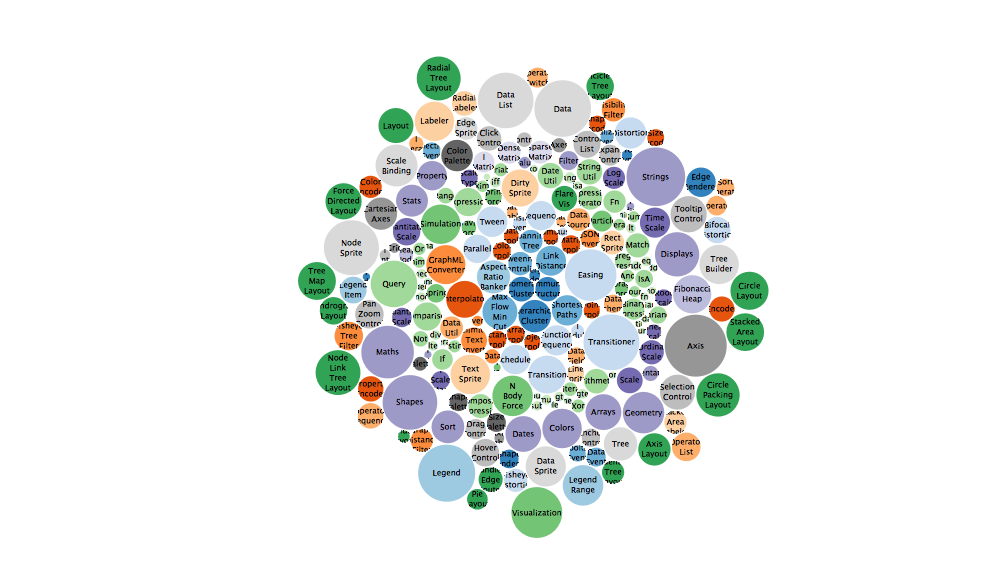

R to D3 rendering tools
================


`R2D3` provides tools to render D3 scripts from R and integrates with `knitr`, `rmarkdown` and RStudio to provide native `d3` output chunks. Specifically, with `R2D3` you can:

-   Render [D3](https://d3js.org/) scripts with ease in R as [htmlwidgets](https://www.htmlwidgets.org/).
-   Use [Shiny](http://shiny.rstudio.com/) with `R2D3` to create interactive D3 applications.

Installation
------------

Install this package by running:

``` r
devtools::install_github("rstudio/r2d3")
```

Getting Started
---------------

To render simple D3 scripts, `R2D3` provides the following variables:

-   **data**: The R data converted to javascript.
-   **svg**: The svg element with the right dimensions.
-   **width/height**: The width/height of the svg.
-   **options**: Additional options provided from R.

These variables can then be used in a D3 script as follows:

    svg.selectAll('rect')
        .data(data)
      .enter()
        .append('rect')
          .attr('width', function(d) { return d * 10; })
          .attr('height', '20px')
          .attr('y', function(d, i) { return i * 22; })
          .attr('fill', 'steelblue');

Finally, this D3 script can be rendered from R by calling `r2d3` with the data and D3 script to be rendered:

``` r
r2d3::r2d3(
  c(10, 30, 40, 35, 20, 10),
  "inst/samples/barchart/barchart.js"
)
```


Advanced Rendering
------------------

More advanced scripts can rely can make use of `r2d3.onRender()` which is similar to `d3.csv()`, `d3.json()`, and other D3 data loading libraries, to trigger specific code during render and use the rest of the code as initialization code, for instace:

    // Initialization
    svg.attr("font-family", "sans-serif")
      .attr("font-size", "8")
      .attr("text-anchor", "middle");
        
    var pack = d3.pack()
      .size([width, height])
      .padding(1.5);
        
    var format = d3.format(",d");
    var color = d3.scaleOrdinal(d3.schemeCategory20c);

    // Rendering
    r2d3.onRender(function(data, svg, width, height, options) {
      var root = d3.hierarchy({children: data})
        .sum(function(d) { return d.value; })
        .each(function(d) {
          if (id = d.data.id) {
            var id, i = id.lastIndexOf(".");
            d.id = id;
            d.package = id.slice(0, i);
            d.class = id.slice(i + 1);
          }
        });

      var node = svg.selectAll(".node")
        .data(pack(root).leaves())
        .enter().append("g")
          .attr("class", "node")
          .attr("transform", function(d) { return "translate(" + d.x + "," + d.y + ")"; });

      node.append("circle")
          .attr("id", function(d) { return d.id; })
          .attr("r", function(d) { return d.r; })
          .style("fill", function(d) { return color(d.package); });

      node.append("clipPath")
          .attr("id", function(d) { return "clip-" + d.id; })
        .append("use")
          .attr("xlink:href", function(d) { return "#" + d.id; });

      node.append("text")
          .attr("clip-path", function(d) { return "url(#clip-" + d.id + ")"; })
        .selectAll("tspan")
        .data(function(d) { return d.class.split(/(?=[A-Z][^A-Z])/g); })
        .enter().append("tspan")
          .attr("x", 0)
          .attr("y", function(d, i, nodes) { return 13 + (i - nodes.length / 2 - 0.5) * 10; })
          .text(function(d) { return d; });

      node.append("title")
          .text(function(d) { return d.id + "\n" + format(d.value); });
    });

``` r
flares <- read.csv("inst/samples/bubbles/flare.csv")
r2d3::r2d3(
  flares[!is.na(flares$value), ],
  "inst/samples/bubbles/bubbles.js",
  version = 4
)
```



R Markdown
----------

For `rmarkdown` documents and Notebooks, `r2d3` adds support for `d3` code as follows:

<pre><code>&#96``{r setup}
library(r2d3)
bars <- c(10, 20, 30)
&#96``</code></pre>
<pre><code>&#96``{d3 data=bars, options='orange'}
svg.selectAll('rect')
    .data(data)
  .enter()
    .append('rect')
      .attr('width', function(d) { return d * 10; })
      .attr('height', '20px')
      .attr('y', function(d, i) { return i * 22; })
      .attr('fill', options);
&#96``</code></pre>


Shiny
-----

`r2d3` provides `renderR2D3()` and `r2d3Output()` to render under Shiny. For example, we can render D3 in a Shiny document as follows:

<pre><code>---
runtime: shiny
output: html_document
---

&#96``{r setup}
library(r2d3)
&#96``

&#96``{r echo=FALSE}
inputPanel(
  sliderInput("bar_max", label = "Max:",
    min = 10, max = 110, value = 10, step = 20)
)

renderR2D3({
  r2d3(
    floor(runif(5, 5, input$bar_max)),
    system.file("samples/barchart/baranims.js", package = "r2d3")
  )
})
&#96``</code></pre>

