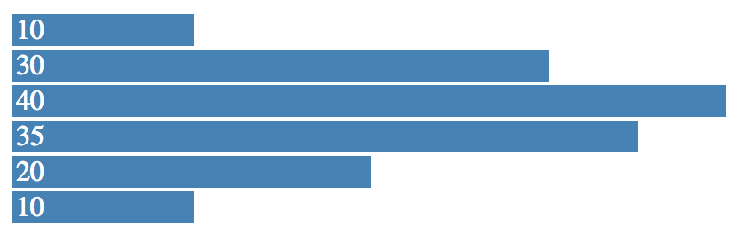

R to D3 rendering tools
================

-   Render [D3](https://d3js.org/) scripts with ease in R as [htmlwidgets](https://www.htmlwidgets.org/).
-   Send data from R to D3 with minimal changes to the D3 source.
-   Animate R data with D3 scripts.

Installation
------------

Install this package by running:

``` r
devtools::install_github("rstudio/d3")
```

Getting Started
---------------

### Static Data

Lets start with a static D3 script that renders a simple bar chart:

    var data = [4, 8, 15, 16, 23, 42];

    d3.select("body")
      .append("div")
        .selectAll("div")
          .data(data)
        .enter().append("div")
          .style("width", function(d) { return d * 10 + "px"; })
          .style("background-color", "steelblue")
          .style("border", "1px solid white")
          .style("color", "white")
          .style("padding-left", "2px")
          .text(function(d) { return d; });

This D3 script can be rendered R by running:

``` r
library(r2d3)
render(script = system.file("samples/barchart-static.js", package = "r2d3"))
```


Since we probably want to change the barchart data from R, we can copy this script as `barchart-variable.js` and remove the following line from the D3 script:

``` js
var data = [4, 8, 15, 16, 23, 42];
```

then, from R we can pass this data as follows:

``` r
render(
  c(4, 8, 15, 16, 23, 42),
  system.file("samples/barchart-variable.js", package = "r2d3")
)
```

By default, data is injected to the D3 script as `data`; however, if the static data is contained in the D3 script with a different name, say as:

``` js
var values = [4, 8, 15, 16, 23, 42];
```

we can then inject the data with that specific name as:

``` r
render(
  c(4, 8, 15, 16, 23, 42),
  script = system.file("samples/barchart-variable.js", package = "r2d3"),
  inject = "values"
)
```

### Dynamic Data

Data in D3 scripts is usually not static. Instead, D3 scripts make use of `d3.csv()`, `d3.json()` and similar functions to fetch data, this usually looks like the following D3 script:

    d3.json("https://s3.amazonaws.com/javierluraschi/d3/barchart-json.json", function(data) {
      var bars = d3.select("body")
        .selectAll("div")
          .data(data);
          
      bars.enter().append("div")
        .style("width", function(d) { return 4 + d * 10 + "px"; })
        .style("background-color", "steelblue")
        .style("border", "1px solid white")
        .style("color", "white")
        .style("padding-left", "2px")
        .text(function(d) { return d; });
      
      bars.exit().remove();
      
      bars.transition()
        .duration(250)
        .style("width", function(d) { return 4 + d * 10 + "px"; })
        .text(function(d) { return d; });
    });

To make use of this script in R, we need to replace the data function (`d3.csv()`, `d3.tsv()`, `d3.json()`, `d3.xml()`, etc.) with `r2.d3()`. Also, you should replaced your root element selector, `d3.select("body")` in the example above, with the `r2.root` selector as follows:

    r2.d3(function(data) {
      var bars = d3.select(r2.root)
        .selectAll("div")
          .data(data);
          
      bars.enter().append("div")
        .style("width", function(d) { return 4 + d * 10 + "px"; })
        .style("background-color", "steelblue")
        .style("border", "1px solid white")
        .style("color", "white")
        .style("padding-left", "2px")
        .text(function(d) { return d; });
      
      bars.exit().remove();
      
      bars.transition()
        .duration(250)
        .style("width", function(d) { return 4 + d * 10 + "px"; })
        .text(function(d) { return d; });
    });

With the modified script, data can be rendered in D3 as follows:

``` r
render(
  data = c(10, 30, 40, 35, 20, 10),
  system.file("samples/barchart-dynamic.js", package = "r2d3")
)
```



Finally, we can also animate data by proving a function and using `animate()`:

``` r
animate(
  function() floor(runif(6, 1, 40)),
  system.file("samples/barchart-dynamic.js", package = "r2d3")
)
```


