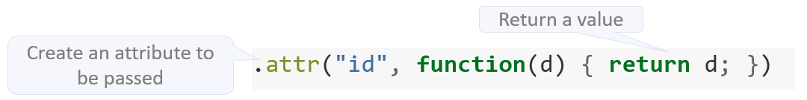
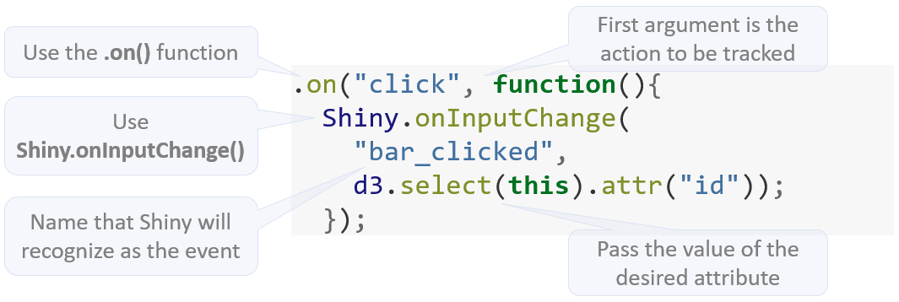

```{r setup, include=FALSE}
knitr::opts_chunk$set(eval = FALSE)
```


Having a D3 plot update based on a changing Shiny input is very common. But, what about having an action that happened inside the D3 plot trigger something in Shiny?  For example, we may want Shiny to know that our D3 bar plot was clicked on, and know which bar was clicked. This ability becomes necessary when features such as drill-down, have to be included in the Shiny app. This can be accomplished by adding a call to a Shiny JS function from inside the D3 script. And in the Shiny app, an event observer can be added that looks for the JS function call. 

## Example

In this example, the bar plot will pass to Shiny the data value of the bar plot that was clicked by the user.  Shiny will then display a notification containing the value of the bar that was clicked on.

Here is the D3 script:

```js
// !preview r2d3 data=c(0.3, 0.6, 0.8, 0.95, 0.40, 0.20)

var barHeight = Math.ceil(height / data.length);

svg.selectAll('rect')
  .data(data)
  .enter().append('rect')
    .attr('width', function(d) { return d * width; })
    .attr('height', barHeight)
    .attr('y', function(d, i) { return i * barHeight; })
    .attr('fill', 'steelblue')
    .attr("id", function(d) { return d; })
    .on("click", function(){
            Shiny.onInputChange(
              "bar_clicked", 
              d3.select(this).attr("id"));
        });
```

### D3 Code breakdown

First, we need to decide which attribute (`.attr`) is going to be passed to Shiny when the user clicks.  Any existing attribute can be passed, such as the value of `y` or `width`, but because no current attribute contain the raw value of the data, a new made up attribute is added called `id`.  The `id` attribute is set to rerun the `d` variable.



Next, the `on()` function is used to capture an event inside the plot.  The first argument is "click", indicating that we want it to be activated when someone clicks on the plot.  The second argument is a function, this function will contain a call to the `Shiny.onInputChange()` JS function.  The first argument of the Shiny JS function is the name that the Shiny app will be looking for. Using a name describing what kind of action we are tracking will be preferred, makes it easier for Shiny developers that include this D3 plot to remember the name. In this case, we will use **bar_clicked**.  The second argument is the value that is returned to Shiny, and for that, we will use the `id` attribute we prepared in the previous code entry.



### Shiny

Place an `observeEvent()` function that looks for a Shiny input named **bar_clicked**, which is the name we gave to the Shiny JS call inside the D3 script:

```r
observeEvent(input$bar_clicked,{  })
```  

This will only trigger an action when the bar is clicked, to know the value that was clicked on, use the exact same input inside the `observeEvent()` command.  For this example, we will just pass the value to a `showNotification()` function.

```r
    observeEvent(input$bar_clicked,{
        showNotification(input$bar_clicked)
    })
```

Here is the full Shiny app code:

```r
library(shiny)
library(r2d3)

ui <- fluidPage(
    d3Output("d3")
)

server <- function(input, output) {
    output$d3 <- renderD3({
        r2d3(
            c(0.3, 0.6, 0.8, 0.95, 0.40, 0.20),
            script = "bar.js"
            )
    })
    observeEvent(input$bar_clicked,{
        showNotification(input$bar_clicked)
    })
}

shinyApp(ui, server)
```

And here is the app in action:


