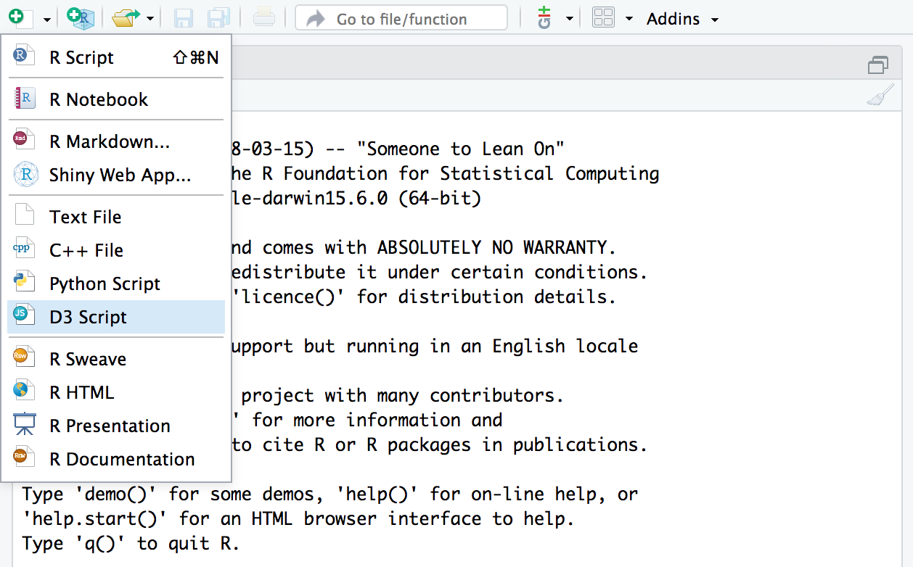
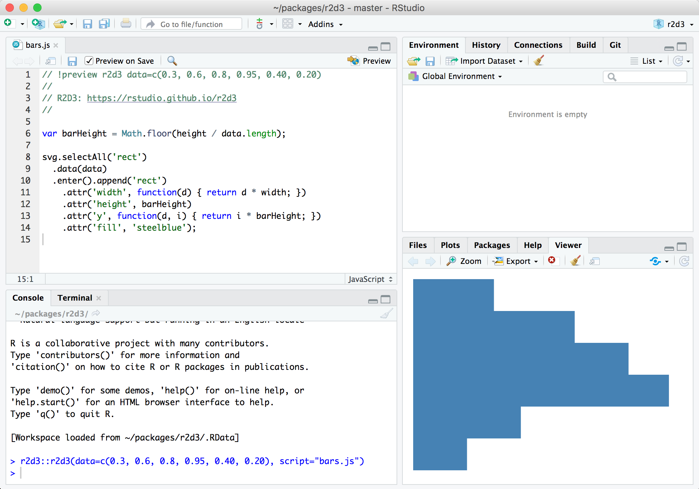
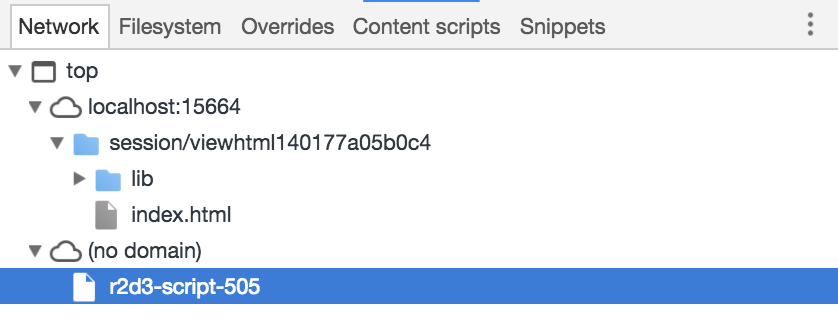

```{r setup, include=FALSE}
knitr::opts_chunk$set(eval = FALSE)
```

## Overview

This article describes recommend workflow for developing D3 visualizations, including:

1) Using integrated tools for **r2d3** within RStudio to preview visualizations; and

2) Using browser debugging tools to pinpoint errors in your code.

Note that the development tools described above are only fully supported within the [RStudio v1.2 preview release](https://www.rstudio.com/products/rstudio/download/) (as opposed to the current stable release) so you should download the daily build before trying these features out.

## RStudio Preview

The [RStudio v1.2 preview release](https://www.rstudio.com/products/rstudio/download/) includes support for previewing D3 scripts as you write them. To try this out, create a D3 script using the new file menu:



A simple template for a D3 script (the barchart.js example shown above) is provided by default. You can use the **Preview** command (Ctrl+Shift+Enter) to render the visualization:



You might wonder where the data comes from for the preview. Note that there is a special comment at the top of the D3 script:

```js
// !preview r2d3 data=c(0.3, 0.6, 0.8, 0.95, 0.40, 0.20)
```

This comment enables you to specify the data (along with any other arguments to the `r2d3()` function) to use for the preview.

### Error Navigation

If an error occurs while rendering a D3 visualization using preview mode then the error will be displayed in the Viewer pane:


The source pane will also be navigated to the location in your script where the error occurred.

### Viewer Options

The `viewer` argument to the `r2d3()` function enables you to customize how D3 visualizations are viewed when printed from within the RStudio console. The following options are available:

| Option  | Description |
|---------------------|---------------------|
| `viewer = "internal"`  | (Default). Display within the RStudio Viewer pane. |
| `viewer = "external"`  | Display within an external RStudio Viewer window. |
| `viewer = "browser"`  | Display within an external web browser (e.g. Chrome). |

The "external" option is useful if your visualization requires more space than an RStudio pane affords. The "browser" option is useful if you need access to browser debugging tools during development.

Here's an example of adding the `viewer` argument to the preview comment at the top of a D3 script:

```js
// !preview r2d3 data=c(0.3, 0.6, 0.8, 0.95, 0.40, 0.20), viewer="external"
```

## Console Logging

When troubleshooting a visualization it is also often useful to print diagnostics to the JavaScript console. This is usually accomplished by calling `console.log()` with a message that can help you troubleshoot the problem at hand.

For instance, the following script does not trigger any runtime errors but also does not render anything at all:

```{js}
// !preview r2d3 data=c(0.3, 0.6, 0.8, 0.95, 0.40, 0.20)

var barHeight = Math.ceil(height / data.length);

svg.selectAll('rect')
  .data(data)
  .enter().append('rect')
    .attr('width', function(d) { return d; })
    .attr('height', barHeight)
    .attr('y', function(d, i) { return i * barHeight; })
    .attr('fill', 'steelblue');
```


In this case, we think the problem might be with the `width` so we print this value to the console as follows:

```{js}
// !preview r2d3 data=c(0.3, 0.6, 0.8, 0.95, 0.40, 0.20)

var barHeight = Math.ceil(height / data.length);

svg.selectAll('rect')
  .data(data)
  .enter().append('rect')
    .attr('width', function(d) {
      console.log("The width has value " + d)
      return d * width * 0;
    })
    .attr('height', barHeight)
    .attr('y', function(d, i) { return i * barHeight; })
    .attr('fill', 'steelblue');
```

**r2d3** renders renders the JavaScript console output directly into the visualization. For this example, this will show that the `width` is `0.2`, which is too small to be visible:


## Debugging

If you need to debug errors or other unexpected behavior in your D3 script, you can use the *Show in new window* window command within the RStudio Viewer to show the visualization in an external web browser:


It's also possible to add the `viewer="browser"` option to your `!preview` comment at the top of the file to skip the RStudio Viewer and route the visualization directly to an external browser:

```js
// !preview r2d3 data=c(0.3, 0.6, 0.8, 0.95, 0.40, 0.20), viewer="browser"
```

Once you've opened the visualization you can use your browser **Developer Tools** to do additional debugging (typically you'll need to reload the page after you've opened the developer tools pane in order to reproduce the error):


Your original D3 script and dependencies are available as a `r2d3-script-###` script which can be used to set breakpoints or inspect errors in detail:




