```{r setup, include=FALSE}
knitr::opts_chunk$set(echo = FALSE)
source("utils.R")
```

The gallery includes several examples adapted for use with **r2d3** from <https://github.com/d3/d3/wiki/Gallery>. Other good sources of D3 examples are <https://bl.ocks.org/mbostock> and <https://vida.io/explore>.

To learn more about how to code your own D3 visualizations, check out the article on [Learning D3](learning_d3.html). 

<!-- This came from running `examples()` from utils.R in the RMD working directory -->

<div class="row">
<div class="col-sm-3">
<a class="thumbnail" title="bubbles" href="gallery/bubbles/">
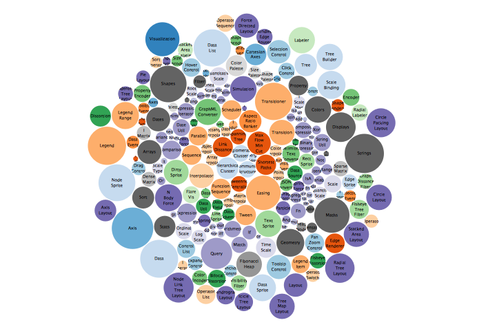
<div class="caption">bubbles</div>
</a>
</div>
<div class="col-sm-3">
<a class="thumbnail" title="bullets" href="gallery/bullets/">
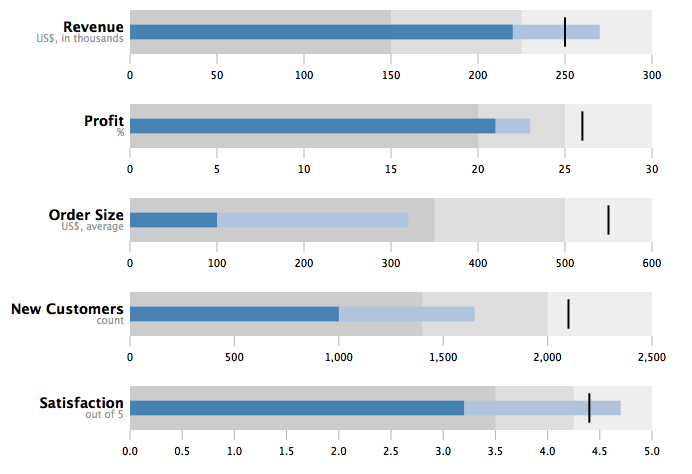
<div class="caption">bullets</div>
</a>
</div>
<div class="col-sm-3">
<a class="thumbnail" title="calendar" href="gallery/calendar/">
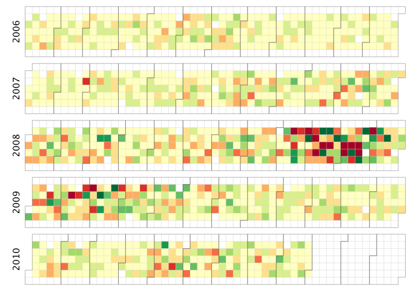
<div class="caption">calendar</div>
</a>
</div>
<div class="col-sm-3">
<a class="thumbnail" title="cartogram" href="gallery/cartogram/">
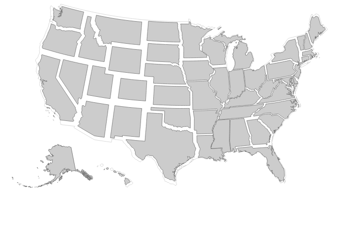
<div class="caption">cartogram</div>
</a>
</div>
</div>
<div class="row">
<div class="col-sm-3">
<a class="thumbnail" title="chord" href="gallery/chord/">
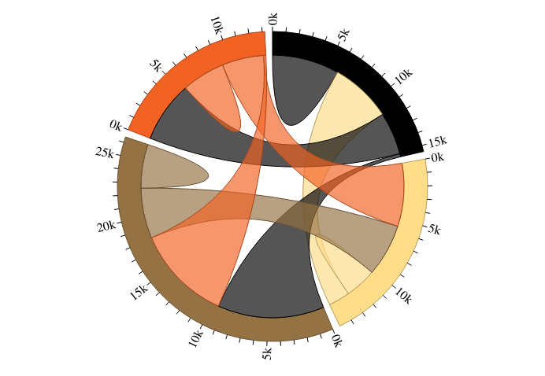
<div class="caption">chord</div>
</a>
</div>
<div class="col-sm-3">
<a class="thumbnail" title="circlepacking" href="gallery/circlepacking/">
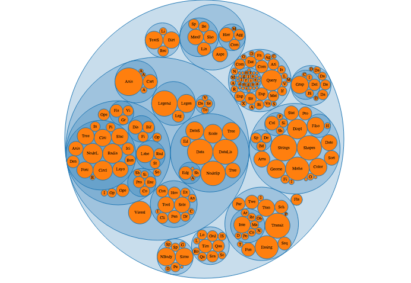
<div class="caption">circlepacking</div>
</a>
</div>
<div class="col-sm-3">
<a class="thumbnail" title="dendogram" href="gallery/dendogram/">
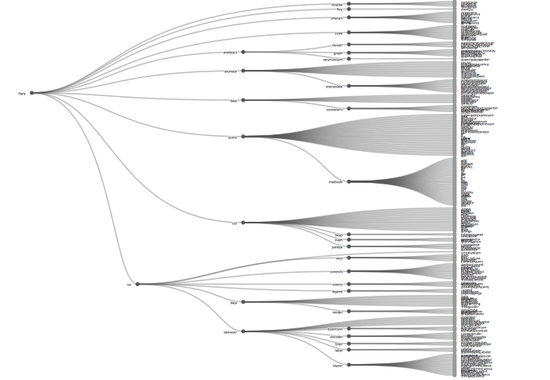
<div class="caption">dendogram</div>
</a>
</div>
<div class="col-sm-3">
<a class="thumbnail" title="forcegraph" href="gallery/forcegraph/">
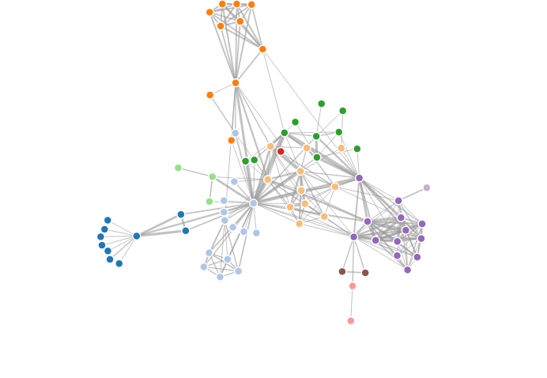
<div class="caption">forcegraph</div>
</a>
</div>
</div>
<div class="row">
<div class="col-sm-3">
<a class="thumbnail" title="morley" href="gallery/morley/">
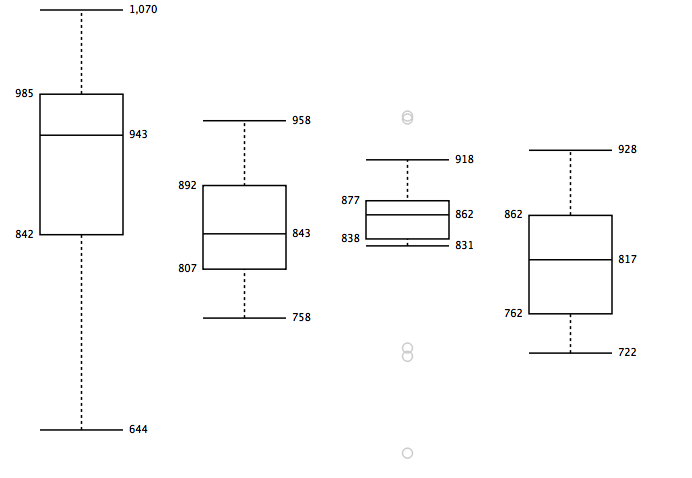
<div class="caption">morley</div>
</a>
</div>
<div class="col-sm-3">
<a class="thumbnail" title="population" href="gallery/population/">
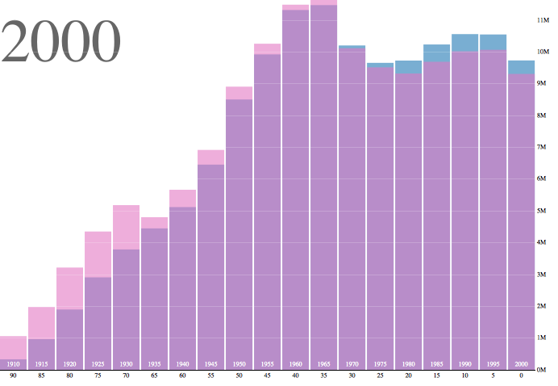
<div class="caption">population</div>
</a>
</div>
<div class="col-sm-3">
<a class="thumbnail" title="radialtree" href="gallery/radialtree/">
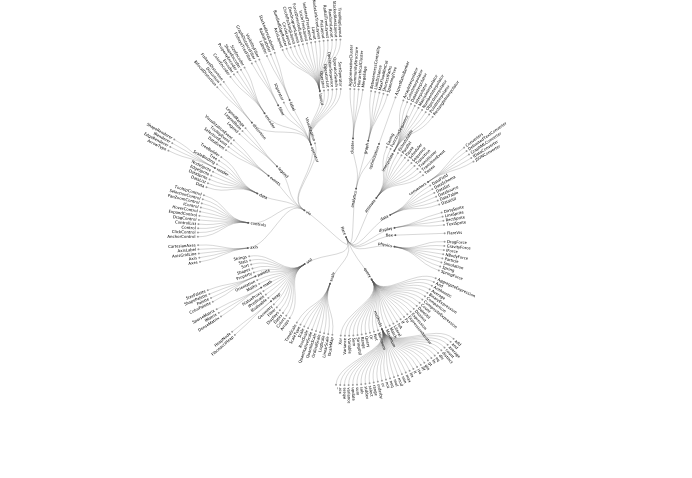
<div class="caption">radialtree</div>
</a>
</div>
<div class="col-sm-3">
<a class="thumbnail" title="stackedbars" href="gallery/stackedbars/">
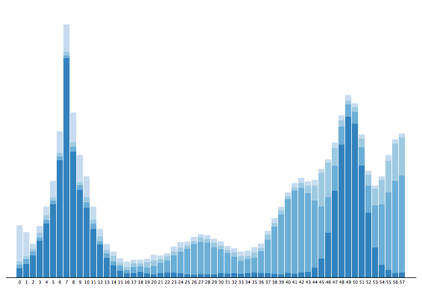
<div class="caption">stackedbars</div>
</a>
</div>
</div>
<div class="row">
<div class="col-sm-3">
<a class="thumbnail" title="streamgraph" href="gallery/streamgraph/">
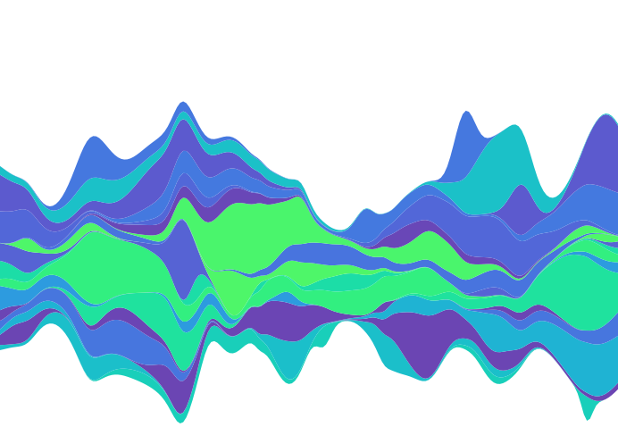
<div class="caption">streamgraph</div>
</a>
</div>
<div class="col-sm-3">
<a class="thumbnail" title="sunburst" href="gallery/sunburst/">
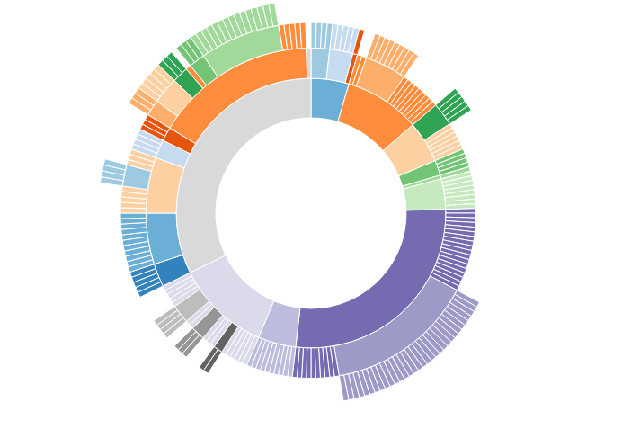
<div class="caption">sunburst</div>
</a>
</div>
<div class="col-sm-3">
<a class="thumbnail" title="treemap" href="gallery/treemap/">
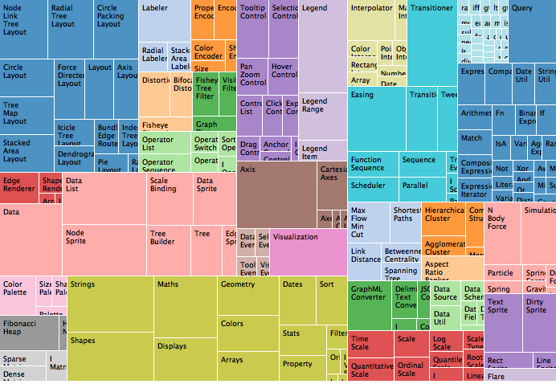
<div class="caption">treemap</div>
</a>
</div>
<div class="col-sm-3">
<a class="thumbnail" title="voronoi" href="gallery/voronoi/">
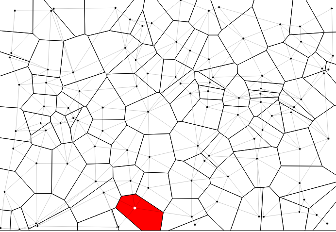
<div class="caption">voronoi</div>
</a>
</div>
</div>


```{js}
$('.template-vignette>.row>.col-md-9').attr('class', 'col-md-12');
```

