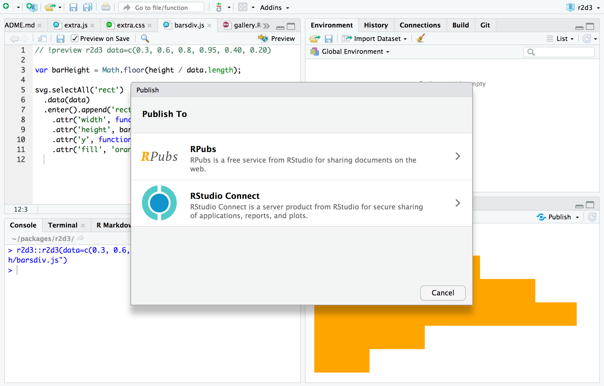
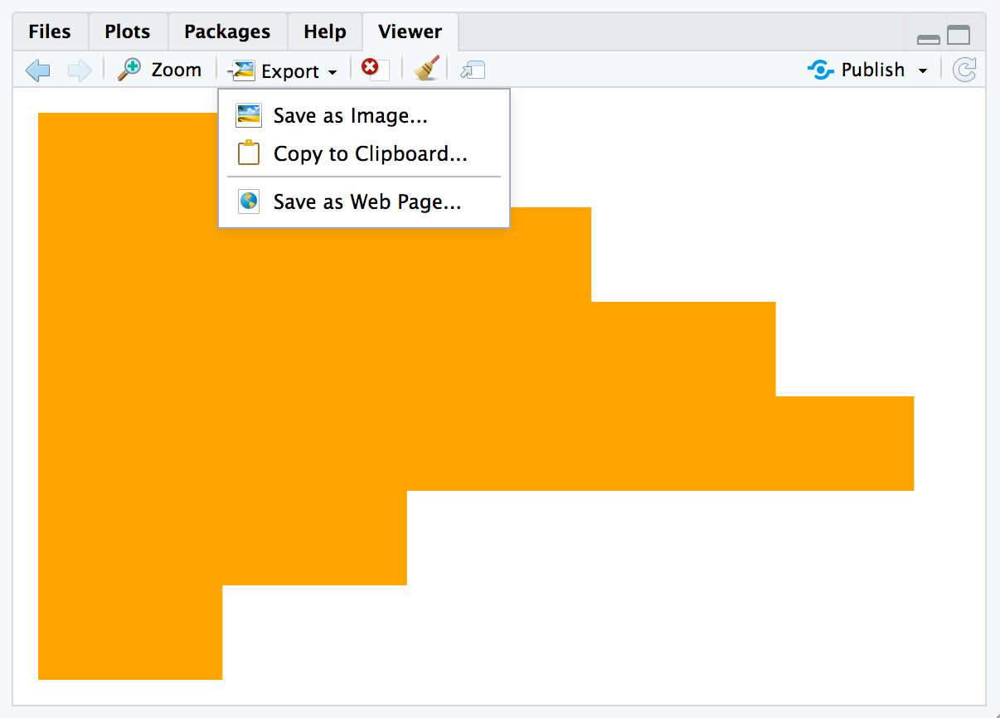
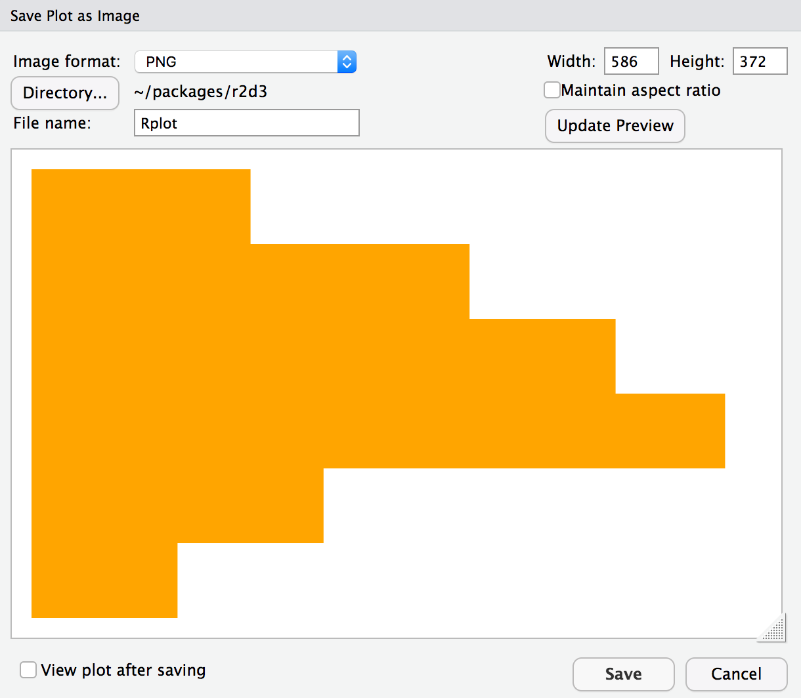

```{r setup, include=FALSE}
knitr::opts_chunk$set(eval = FALSE)
```

## Overview

There are a variety of ways to publish D3 visualizations, including:

1) Saving as a standalone HTML file

2) Publishing to a service like [RPubs](https://rpubs.com)

3) Exporting to a static PNG version of the visualization

4) Copying to the clipboard and pasting into another application

5) Including within an [R Markdown](https://rmarkdown.rstudio.com) document or dashboard

6) Including within a [Shiny](https://shiny.rstudio.com) application

This article describes each of these techniques for publishing visualizations

## Publishing HTML

### Save as HTML

You can use the `save_d3_html()` function to save a D3 visualization as an HTML file. For example:

```{r}
library(r2d3)
viz <- r2d3(data=c(0.3, 0.6, 0.8, 0.95, 0.40, 0.20), script = "barchart.js")
save_d3_html(viz, file = "viz.html")
```

By default, the HTML file will be self-contained (all CSS and JavaScript dependencies will be embedded with the file) so that it's easy to share. If you want the dependencies written to a separate directory you can set `selfcontained = FALSE`. For example:

```{r}
library(r2d3)
viz <- r2d3(data=c(0.3, 0.6, 0.8, 0.95, 0.40, 0.20), script = "barchart.js")
save_d3_html(viz, file = "viz.html", selfcontained = FALSE)
```

Setting `selfcontained = FALSE` is useful if you want to embed your D3 visualization within another HTML page since it separates the visualization itself from various link and script dependencies that need to be placed in the HTML head.

### RPubs / RStudio Connect

You can also publish visualizations to [RPubs](https://rpubs.com) or [RStudio Connect](https://www.rstudio.com/products/connect/). To do this, click the **Publish** button located in the top right of the RStudio Viewer pane:




## Static Images

### save_d3_png()

You can use the `save_d3_png()` function to save a D3 visualization as a PNG image. For example:

```{r}
library(r2d3)
viz <- r2d3(data=c(0.3, 0.6, 0.8, 0.95, 0.40, 0.20), script = "barchart.js")
save_d3_png(viz, file = "viz.png")
```

Using the `save_d3_png()` function requires that you install the [webshot](https://cran.r-project.org/package=webshot) package, as well as the phantom.js headless browser (which you can install using the function `webshot::install_phantomjs()`).

### RStudio Viewer

The RStudio Viewer pane has an **Export** menu that enables you to export D3 visualizations as PNG files as well as copy visualizations to the clipboard:



The export dialog enables you to customize the size of the exported or copied image:



## R Markdown

You can include D3 visualizations in an R Markdown document or R Notebook. You can do this by calling the `r2d3()` function from within an R code chunk:

<pre><code>---
output: html_document
---

&#96``{r}
library(r2d3)
r2d3(data=c(0.3, 0.6, 0.8, 0.95, 0.40, 0.20), script = "barchart.js")
&#96``</code></pre>


You can also include D3 visualization code inline using the `d3` R Markdown engine:

<pre><code>&#96``{r setup}
library(r2d3)
bars &lt;- c(10, 20, 30)
&#96``</code></pre>

<pre><code>&#96``{d3 data=bars, options=list(color = 'orange')}
svg.selectAll('rect')
  .data(data)
  .enter()
    .append('rect')
      .attr('width', function(d) { return d * 10; })
      .attr('height', '20px')
      .attr('y', function(d, i) { return i * 22; })
      .attr('fill', options.color);
&#96``</code></pre>


Note that in order to use the `d3` engine you need to add `library(r2d3)` to the setup chunk (as illustrated above).

### flexdashboard

The [flexdashboard](https://rmarkdown.rstudio.com/flexdashboard) R Markdown format is a great way to publish a set of related D3 visualizations. You can use flexdashbaord to combine D3 visualizations with narrative, data tables, other [htmlwidgets](http://www.htmlwidgets.org), and static R plots:


Check out the [flexdashboard online documentation](https://rmarkdown.rstudio.com/flexdashboard) for additional details.


## Shiny applications

The `renderD3()` and `d3Output()` functions enable you to include D3 visualizations within [Shiny](https://shiny.rstudio.com) applications:

```{r eval=FALSE}
library(shiny)
library(r2d3)

ui <- fluidPage(
  inputPanel(
    sliderInput("bar_max", label = "Max:",
                min = 0.1, max = 1.0, value = 0.2, step = 0.1)
  ),
  d3Output("d3")
)

server <- function(input, output) {
  output$d3 <- renderD3({
    r2d3(
      runif(5, 0, input$bar_max),
      script = system.file("examples/baranims.js", package = "r2d3")
    )
  })
}

shinyApp(ui = ui, server = server)
```


